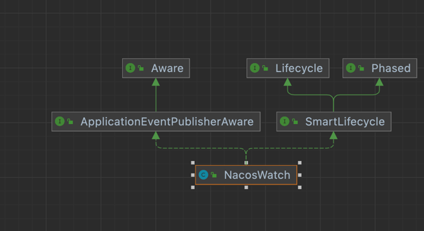

# dubbo分析
## dubbo的SPi机制
### Nacos Server 的注册表结构 如下

``` java
    //com.alibaba.nacos.naming.core.ServiceManager
     /**
     * Map(namespace, Map(group::serviceName, Service)).
     */
    private final Map<String, Map<String, Service>> serviceMap = new ConcurrentHashMap<>();
```
这是一个典型的Map结构 key是namespace 值又是一个Map map的key是group和serverName名称组成 值是service实体
service又是一个map对象
``` java
    //package com.alibaba.nacos.naming.core.Service
     /**
     * Map(namespace, Map(group::serviceName, Service)).
     */
 
    private Map<String, Cluster> clusterMap = new HashMap<>();
```
Map的Key值为Cluster的名字，Value为Cluster对象，Cluster对象中有两个Set的数据结构，用来存储Instance，这个Instance才是真正的客户端注册过来的实例信息。
``` java
//com.alibaba.nacos.naming.core.Cluster
    //持久化实例
    private Set<Instance> persistentInstances = new HashSet<>();
    //临时实例
    private Set<Instance> ephemeralInstances = new HashSet<>();
```
这里有两个Set，一个是用来存储临时实例，一个是用来存储持久化实例，有个关键点，什么情况会存储在临时实例，什么情况下会存储持久化实例，这个是由客户端的配置来决定的，默认情况下客户端配置ephemeral=true，如果你想把实例用持久化的方式来存储，可以设置ephemeral=false，这样在客户端发起注册的时候会把这个参数带到Nacos Server，Nacos Server就会按照持久化的方式来存储。
注意：Nacos目前持久化存储的方式采用的是本地文件存储的方式。

### 客户端注册流程如下
1.基于client-server注册模式 整合springcloud集成nacos注册中心是使用这种注册流程的

nacos-client--------》nacos-server 通过http请求代码如下
``` java
//com.alibaba.nacos.client.naming.NacosNamingService 核心方法注册实例信息
   public void registerInstance(String serviceName, String groupName, Instance instance) throws NacosException {
        String groupedServiceName = NamingUtils.getGroupedName(serviceName, groupName);
        if (instance.isEphemeral()) {
           //判断是否临时实例 临时实例添加心跳检测线程任务
            BeatInfo beatInfo = this.beatReactor.buildBeatInfo(groupedServiceName, instance);
            this.beatReactor.addBeatInfo(groupedServiceName, beatInfo);
        }

        this.serverProxy.registerService(groupedServiceName, groupName, instance);
    }
```
接下来查看serverProxy这个类 具体如下所示
``` java
//主要功能是拼接请求参数去请求 nacos-server 的接口
public void registerService(String serviceName, String groupName, Instance instance) throws NacosException {
        LogUtils.NAMING_LOGGER.info("[REGISTER-SERVICE] {} registering service {} with instance: {}", new Object[]{this.namespaceId, serviceName, instance});
        Map<String, String> params = new HashMap(16);
        params.put("namespaceId", this.namespaceId);
        params.put("serviceName", serviceName);
        params.put("groupName", groupName);
        params.put("clusterName", instance.getClusterName());
        params.put("ip", instance.getIp());
        params.put("port", String.valueOf(instance.getPort()));
        params.put("weight", String.valueOf(instance.getWeight()));
        params.put("enable", String.valueOf(instance.isEnabled()));
        params.put("healthy", String.valueOf(instance.isHealthy()));
        params.put("ephemeral", String.valueOf(instance.isEphemeral()));
        params.put("metadata", JacksonUtils.toJson(instance.getMetadata()));
        this.reqApi(UtilAndComs.nacosUrlInstance, params, "POST");
    }
```
接下来我们看reqApi这个方法
```java
// 这是客户端请求nacos-server核心代码 
public String reqApi(String api, Map<String, String> params, Map<String, String> body, List<String> servers,String method) throws NacosException {

        params.put(CommonParams.NAMESPACE_ID, getNamespaceId());
        if (CollectionUtils.isEmpty(servers) && StringUtils.isBlank(nacosDomain)) {
        throw new NacosException(NacosException.INVALID_PARAM, "no server available");
        }

        NacosException exception = new NacosException();

        //如果是单个注册中心走这里
        if (StringUtils.isNotBlank(nacosDomain)) {
        for (int i = 0; i < maxRetry; i++) {//默认重试三次
        try {
        return callServer(api, params, body, nacosDomain, method);
        } catch (NacosException e) {
        exception = e;
        if (NAMING_LOGGER.isDebugEnabled()) {
        NAMING_LOGGER.debug("request {} failed.", nacosDomain, e);
        }
        }
        }
        } else {  //如果是多个注册中心走这里 配置了多个注册中心
        Random random = new Random(System.currentTimeMillis());
        int index = random.nextInt(servers.size());

        for (int i = 0; i < servers.size(); i++) {
        String server = servers.get(index);
        try {
        return callServer(api, params, body, server, method);
        } catch (NacosException e) {
        exception = e;
        if (NAMING_LOGGER.isDebugEnabled()) {
        NAMING_LOGGER.debug("request {} failed.", server, e);
        }
        }
        index = (index + 1) % servers.size();
        }
        }

        NAMING_LOGGER.error("request: {} failed, servers: {}, code: {}, msg: {}", api, servers, exception.getErrCode(),
        exception.getErrMsg());

        throw new NacosException(exception.getErrCode(),
        "failed to req API:" + api + " after all servers(" + servers + ") tried: " + exception.getMessage());

        }
```
以上就是nacos-clien的注册流程结束了 接下来我们查看一下nacos-server端代码
``` java
//com.alibaba.nacos.naming.controllers.InstanceController#register。
    @CanDistro
    @PostMapping
    @Secured(parser = NamingResourceParser.class, action = ActionTypes.WRITE)
    public String register(HttpServletRequest request) throws Exception {
        final String namespaceId = WebUtils
                .optional(request, CommonParams.NAMESPACE_ID, Constants.DEFAULT_NAMESPACE_ID);
        final String serviceName = WebUtils.required(request, CommonParams.SERVICE_NAME);
        NamingUtils.checkServiceNameFormat(serviceName);
        final Instance instance = parseInstance(request);
        serviceManager.registerInstance(namespaceId, serviceName, instance);
        return "ok";
    }
```
提供注册接口看一下注册的实例流程registerInstance的方法
``` java
//创建一个空服务 通过服务名称和namespace获取一个服务 因为 注册表的结构是 Map(namespace, Map(group::serviceName, Service))这种形式的
 public void registerInstance(String namespaceId, String serviceName, Instance instance) throws NacosException {
        
        createEmptyService(namespaceId, serviceName, instance.isEphemeral());
        
        Service service = getService(namespaceId, serviceName);
        
        if (service == null) {
            throw new NacosException(NacosException.INVALID_PARAM,
                    "service not found, namespace: " + namespaceId + ", service: " + serviceName);
        }
        
        addInstance(namespaceId, serviceName, instance.isEphemeral(), instance);
    }
```
接下来查看一下添加实例的方法。代码如下
``` java
public void addInstance(String namespaceId, String serviceName, boolean ephemeral, Instance... ips)
throws NacosException {

        String key = KeyBuilder.buildInstanceListKey(namespaceId, serviceName, ephemeral);
        
        Service service = getService(namespaceId, serviceName);
        
        //锁定service不允许修改防止并发修改
        synchronized (service) {
            List<Instance> instanceList = addIpAddresses(service, ephemeral, ips);
            Instances instances = new Instances();
            instances.setInstanceList(instanceList);
            //同步到其他的机器 todo下次分析同步数据到其他集群
            consistencyService.put(key, instances);
        }
    }
```
此时已经完成更新注册表的信息 服务端注册服务信息更新服务到此结束。

### 客户端服务发现流程
在spring.factories中配置了一个NacosDiscoveryClientConfiguration类，此类向Spring中注入了一个NacosWatch类,这类的类图如下：

从上图可以看出，此类实现了Lifecycle接口，这个接口是Spring设计的生命周期接口，如果实现这个接口，那么就会在Spring加载完所有的Bean并初始化之后就会回调start()方法，在这个方法中完成了服务的拉取并更新到本地缓存，代码如下：
```java
 public void start() {
        if (this.running.compareAndSet(false, true)) {
            EventListener eventListener = (EventListener)this.listenerMap.computeIfAbsent(this.buildKey(), (event) -> {
                return new EventListener() {
                    public void onEvent(Event event) {
                        if (event instanceof NamingEvent) {
                            List instances = ((NamingEvent)event).getInstances();
                            Optional instanceOptional = NacosWatch.this.selectCurrentInstance(instances);
                            instanceOptional.ifPresent((currentInstance) -> {
                                NacosWatch.this.resetIfNeeded(currentInstance);
                            });
                            NacosWatch.this.publisher.publishEvent(new HeartbeatEvent(NacosWatch.this, NacosWatch.this.nacosWatchIndex.getAndIncrement()));
                        }

                    }
                };
            });
            NamingService namingService = this.nacosServiceManager.getNamingService(this.properties.getNacosProperties());

            try {
                namingService.subscribe(this.properties.getService(), this.properties.getGroup(), Arrays.asList(this.properties.getClusterName()), eventListener);
            } catch (Exception var4) {
                log.error("namingService subscribe failed, properties:{}", this.properties, var4);
            }
        }

    }


```
```java
#com.alibaba.nacos.client.naming.core.HostReactor #getServiceInfo
//获取服务的信息
 public ServiceInfo getServiceInfo(final String serviceName, final String clusters) {
        
        NAMING_LOGGER.debug("failover-mode: " + failoverReactor.isFailoverSwitch());
        String key = ServiceInfo.getKey(serviceName, clusters);
        if (failoverReactor.isFailoverSwitch()) {
            return failoverReactor.getService(key);
        }
        //先从本地缓存获取服务信息
        ServiceInfo serviceObj = getServiceInfo0(serviceName, clusters);
        
        if (null == serviceObj) {
            serviceObj = new ServiceInfo(serviceName, clusters);
            
            serviceInfoMap.put(serviceObj.getKey(), serviceObj);
            
            updatingMap.put(serviceName, new Object());
            updateServiceNow(serviceName, clusters);
            updatingMap.remove(serviceName);
            
        } else if (updatingMap.containsKey(serviceName)) {
            
            if (UPDATE_HOLD_INTERVAL > 0) {
                // hold a moment waiting for update finish
                synchronized (serviceObj) {
                    try {
                        serviceObj.wait(UPDATE_HOLD_INTERVAL);
                    } catch (InterruptedException e) {
                        NAMING_LOGGER
                                .error("[getServiceInfo] serviceName:" + serviceName + ", clusters:" + clusters, e);
                    }
                }
            }
        }
        
        scheduleUpdateIfAbsent(serviceName, clusters);
        
        return serviceInfoMap.get(serviceObj.getKey());
    }

```
`````java
//更新服务信息
 private void updateServiceNow(String serviceName, String clusters) {
        try {
            updateService(serviceName, clusters);
        } catch (NacosException e) {
            NAMING_LOGGER.error("[NA] failed to update serviceName: " + serviceName, e);
        }
    }
`````

`````java
 /**
     * Update service now.
     *
     * @param serviceName service name
     * @param clusters    clusters
     */
    public void updateService(String serviceName, String clusters) throws NacosException {
        ServiceInfo oldService = getServiceInfo0(serviceName, clusters);
        try {
            //请求list获取服务数据穿了一个udp端口nacosServer接收到service修改 第一时间通过udp通知订阅者
            String result = serverProxy.queryList(serviceName, clusters, pushReceiver.getUdpPort(), false);
            
            if (StringUtils.isNotEmpty(result)) {
                processServiceJson(result);
            }
        } finally {
            if (oldService != null) {
                synchronized (oldService) {
                    oldService.notifyAll();
                }
            }
        }
    }
    
`````
````java
 /**
     * Schedule update if absent.
     *
     * @param serviceName service name
     * @param clusters    clusters
     */
    public void scheduleUpdateIfAbsent(String serviceName, String clusters) {
        if (futureMap.get(ServiceInfo.getKey(serviceName, clusters)) != null) {
            return;
        }
        
        synchronized (futureMap) {
            if (futureMap.get(ServiceInfo.getKey(serviceName, clusters)) != null) {
                return;
            }
            
            ScheduledFuture<?> future = addTask(new UpdateTask(serviceName, clusters));
            futureMap.put(ServiceInfo.getKey(serviceName, clusters), future);
        }
    }
````
从源码可以看出最后也是调用了serverProxy.queryList方法，这个方法也是发起了一个HTTP的请求，调用了Nacos Server的/nacos/v1/ns/instance/list接口，进行服务拉取。
到这里已经从源码级别分析了Spring Cloud的集成了Nacos客户端关于服务拉取的代码，其实代码还是比较简单的，总结来说就是构造出list接口需要的参数，然后发起HTTP请求，进行服务拉取。
从源码中注意留意一个scheduleUpdateIfAbsent方法的调用，这里提交了一个UpdateTask任务，UpdateTask是一个实现了Runnable接口的类，主要代码如下：
````java
 public class UpdateTask implements Runnable {
        
        long lastRefTime = Long.MAX_VALUE;
        
        private final String clusters;
        
        private final String serviceName;
        
        /**
         * the fail situation. 1:can't connect to server 2:serviceInfo's hosts is empty
         */
        private int failCount = 0;
        
        public UpdateTask(String serviceName, String clusters) {
            this.serviceName = serviceName;
            this.clusters = clusters;
        }
        
        private void incFailCount() {
            int limit = 6;
            if (failCount == limit) {
                return;
            }
            failCount++;
        }
        
        private void resetFailCount() {
            failCount = 0;
        }
        
        @Override
        public void run() {
            long delayTime = DEFAULT_DELAY;
            
            try {
                ServiceInfo serviceObj = serviceInfoMap.get(ServiceInfo.getKey(serviceName, clusters));
                
                if (serviceObj == null) {
                    updateService(serviceName, clusters);
                    return;
                }
                
                if (serviceObj.getLastRefTime() <= lastRefTime) {
                    updateService(serviceName, clusters);
                    serviceObj = serviceInfoMap.get(ServiceInfo.getKey(serviceName, clusters));
                } else {
                    // if serviceName already updated by push, we should not override it
                    // since the push data may be different from pull through force push
                    refreshOnly(serviceName, clusters);
                }
                
                lastRefTime = serviceObj.getLastRefTime();
                
                if (!notifier.isSubscribed(serviceName, clusters) && !futureMap
                        .containsKey(ServiceInfo.getKey(serviceName, clusters))) {
                    // abort the update task
                    NAMING_LOGGER.info("update task is stopped, service:" + serviceName + ", clusters:" + clusters);
                    return;
                }
                if (CollectionUtils.isEmpty(serviceObj.getHosts())) {
                    incFailCount();
                    return;
                }
                delayTime = serviceObj.getCacheMillis();
                resetFailCount();
            } catch (Throwable e) {
                incFailCount();
                NAMING_LOGGER.warn("[NA] failed to update serviceName: " + serviceName, e);
            } finally {
                executor.schedule(this, Math.min(delayTime << failCount, DEFAULT_DELAY * 60), TimeUnit.MILLISECONDS);
            }
        }
    }
````
从源码中可以看出，这段代码相当于定时10s（这个时间是从/nacos/v1/ns/instance/list接口里回传回来的）拉取一次服务，这里有个Nacos Server比较巧妙的设计需要提一下，在updateServiceNow方法中可以看到调用服务端/nacos/v1/ns/instance/list接口的时候传入了一个Udp的端口，这个端口的作用是如果Nacos Server感知到Service的变化，就会把变化信息通知给订阅了这个Service信息的客户端。
### 服务端服务发现流程逻辑
服务端提供的接口为/nacos/v1/ns/instance/list
com.alibaba.nacos.naming.controllers.InstanceController#list
``` java
    @GetMapping("/list")
    @Secured(parser = NamingResourceParser.class, action = ActionTypes.READ)
    public ObjectNode list(HttpServletRequest request) throws Exception {
        String namespaceId = WebUtils.optional(request, CommonParams.NAMESPACE_ID, Constants.DEFAULT_NAMESPACE_ID);
        String serviceName = WebUtils.required(request, CommonParams.SERVICE_NAME);
        NamingUtils.checkServiceNameFormat(serviceName);
        
        String agent = WebUtils.getUserAgent(request);
        String clusters = WebUtils.optional(request, "clusters", StringUtils.EMPTY);
        String clientIP = WebUtils.optional(request, "clientIP", StringUtils.EMPTY);
        int udpPort = Integer.parseInt(WebUtils.optional(request, "udpPort", "0"));
        String env = WebUtils.optional(request, "env", StringUtils.EMPTY);
        boolean isCheck = Boolean.parseBoolean(WebUtils.optional(request, "isCheck", "false"));
        
        String app = WebUtils.optional(request, "app", StringUtils.EMPTY);
        
        String tenant = WebUtils.optional(request, "tid", StringUtils.EMPTY);
        
        boolean healthyOnly = Boolean.parseBoolean(WebUtils.optional(request, "healthyOnly", "false"));
        
        return doSrvIpxt(namespaceId, serviceName, agent, clusters, clientIP, udpPort, env, isCheck, app, tenant,
                healthyOnly);
    }
```


