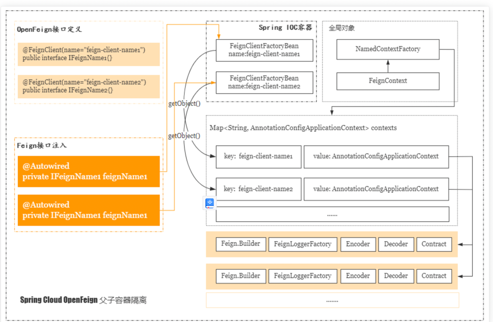
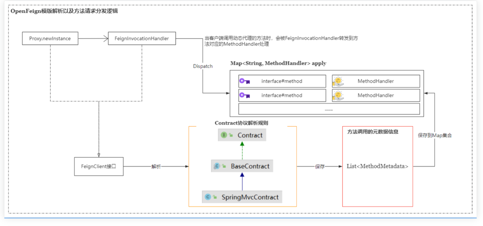
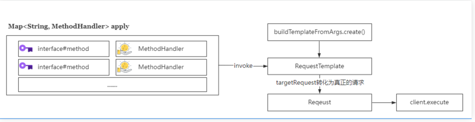

# open-fegin 工作流程
OpenFeign是一个远程客户端请求代理，它的基本作用是让开发者能够以面向接口的方式来实现远程调用，从而屏蔽底层通信的复杂性，它的具体原理如下图所示。
## OpenFeign注解扫描与解析
思考， 一个被声明了@FeignClient注解的接口，使用@Autowired进行依赖注入，而最终这个接口能够正常被注入实例。
1.被@FeignClient声明的接口，在Spring容器启动时，会被解析。
2.由于被Spring容器加载的是接口，而接口又没有实现类，因此Spring容器解析时，会生成一个动态代理类。
### EnableFeignClient原理
@FeignClient注解是在什么时候被解析的呢？基于我们之前所有积累的知识，无非就以下这几种

ImportSelector，批量导入bean
ImportBeanDefinitionRegistrar，导入bean声明并进行注册
BeanFactoryPostProcessor ， 一个bean被装载的前后处理器
在这几个选项中，似乎ImportBeanDefinitionRegistrar更合适，因为第一个是批量导入一个bean的string集合，不适合做动态Bean的声明。 而BeanFactoryPostProcessor是一个Bean初始化之前和之后被调用的处理器。

而在我们的FeignClient声明中，并没有Spring相关的注解，所以自然也不会被Spring容器加载和触发。
在集成FeignClient时，我们在SpringBoot的main方法中，声明了一个注解@EnableFeignClients(basePackages = "com.gupaoedu.ms.api")。这个注解需要填写一个指定的包名。

嗯，看到这里，基本上就能猜测出，这个注解必然和@FeignClient注解的解析有莫大的关系。

下面这段代码是@EnableFeignClients注解的声明，果然看到了一个很熟悉的面孔FeignClientsRegistrar。
``` java
@Retention(RetentionPolicy.RUNTIME)
@Target(ElementType.TYPE)
@Documented
@Import(FeignClientsRegistrar.class)
public @interface EnableFeignClients {

}
```
#### FeignClientsRegistrar
FeignClientRegistrar，主要功能就是针对声明@FeignClient注解的接口进行扫描和注入到IOC容器
``` java
class FeignClientsRegistrar
		implements ImportBeanDefinitionRegistrar, ResourceLoaderAware, EnvironmentAware {
		}
```
果然，这个类实现了ImportBeanDefinitionRegistrar接口
```
public interface ImportBeanDefinitionRegistrar {
    default void registerBeanDefinitions(AnnotationMetadata importingClassMetadata, BeanDefinitionRegistry registry, BeanNameGenerator importBeanNameGenerator) {
        this.registerBeanDefinitions(importingClassMetadata, registry);
    }

    default void registerBeanDefinitions(AnnotationMetadata importingClassMetadata, BeanDefinitionRegistry registry) {
    }
}
```
这个接口有两个重载的方法，用来实现Bean的声明和注册。
#### FeignClientsRegistrar.registerBeanDefinitions
registerDefaultConfiguration 方法内部从 SpringBoot 启动类上检查是否有 @EnableFeignClients, 有该注解的话， 则完成Feign框架相关的一些配置内容注册。
registerFeignClients 方法内部从 classpath 中， 扫描获得 @FeignClient 修饰的类， 将类的内容解析为 BeanDefinition , 最终通过调用 Spring 框架中的 BeanDefinitionReaderUtils.resgisterBeanDefinition 将解析处理过的 FeignClient BeanDeifinition 添加到 spring 容器中

```java
//注册@EnableFeignClients中定义defaultConfiguration属性下的类，包装成FeignClientSpecification，注册到Spring容器。
//在@FeignClient中有一个属性：configuration，这个属性是表示各个FeignClient自定义的配置类，后面也会通过调用registerClientConfiguration方法来注册成FeignClientSpecification到容器。
//所以，这里可以完全理解在@EnableFeignClients中配置的是做为兜底的配置，在各个@FeignClient配置的就是自定义的情况。
	public void registerBeanDefinitions(AnnotationMetadata metadata,
			BeanDefinitionRegistry registry) {
		//有这个注解才开始注册registerFeignClients到springbean容器
		//注册缺省配置到Spring容器
		registerDefaultConfiguration(metadata, registry);
		//注册所发现的各个客户端FeignClient到Spring容器
		registerFeignClients(metadata, registry);
	}
```
这里面需要重点分析的就是registerFeignClients方法，这个方法主要是扫描类路径下所有的@FeignClient注解，然后进行动态Bean的注入。它最终会调用registerFeignClient方法。
```java
public void registerFeignClients(AnnotationMetadata metadata,
			BeanDefinitionRegistry registry) {
    registerFeignClient(registry, annotationMetadata, attributes);
}
```
##### FeignClientsRegistrar.registerFeignClients
```java
public void registerFeignClients(AnnotationMetadata metadata,
			BeanDefinitionRegistry registry) {
		ClassPathScanningCandidateComponentProvider scanner = getScanner();
		scanner.setResourceLoader(this.resourceLoader);

		Set<String> basePackages;
        ///获取@EnableFeignClients注解的元数据
		Map<String, Object> attrs = metadata
				.getAnnotationAttributes(EnableFeignClients.class.getName());
		AnnotationTypeFilter annotationTypeFilter = new AnnotationTypeFilter(
				FeignClient.class);
//获取@EnableFeignClients注解中的clients属性，可以配置@FeignClient声明的类，如果配置了，则需要扫描并加载
		final Class<?>[] clients = attrs == null ? null
				: (Class<?>[]) attrs.get("clients");
		if (clients == null || clients.length == 0) {
        //默认TypeFilter生效，这种模式会查询出许多不符合你要求的class名
        //添加包含过滤的属性@FeignClient。
			scanner.addIncludeFilter(annotationTypeFilter);
			basePackages = getBasePackages(metadata);
		}
		else {
			final Set<String> clientClasses = new HashSet<>();
			basePackages = new HashSet<>();
			for (Class<?> clazz : clients) {
				basePackages.add(ClassUtils.getPackageName(clazz));
				clientClasses.add(clazz.getCanonicalName());
			}
			AbstractClassTestingTypeFilter filter = new AbstractClassTestingTypeFilter() {
				@Override
				protected boolean match(ClassMetadata metadata) {
					String cleaned = metadata.getClassName().replaceAll("\\$", ".");
					return clientClasses.contains(cleaned);
				}
			};
			scanner.addIncludeFilter(
					new AllTypeFilter(Arrays.asList(filter, annotationTypeFilter)));
		}

		for (String basePackage : basePackages) {
			Set<BeanDefinition> candidateComponents = scanner
					.findCandidateComponents(basePackage);
			for (BeanDefinition candidateComponent : candidateComponents) {
				if (candidateComponent instanceof AnnotatedBeanDefinition) {
					// verify annotated class is an interface
					AnnotatedBeanDefinition beanDefinition = (AnnotatedBeanDefinition) candidateComponent;
					AnnotationMetadata annotationMetadata = beanDefinition.getMetadata();
					Assert.isTrue(annotationMetadata.isInterface(),
							"@FeignClient can only be specified on an interface");

					// 获取所定义的feign客户端接口上的注解@FeignClient属性
					Map<String, Object> attributes = annotationMetadata
							.getAnnotationAttributes(
									FeignClient.class.getCanonicalName());
                  //获取@FeignClient中配置的服务名称。
					String name = getClientName(attributes);
					registerClientConfiguration(registry, name,
							attributes.get("configuration"));

					registerFeignClient(registry, annotationMetadata, attributes);
				}
			}
		}
	}
```
##### FeignClient Bean的注册
这个方法就是把FeignClient接口注册到Spring IOC容器，
```java
private void registerFeignClient(BeanDefinitionRegistry registry,
			AnnotationMetadata annotationMetadata, Map<String, Object> attributes) {
    //获取FeignClient接口的类全路径
		String className = annotationMetadata.getClassName();
		BeanDefinitionBuilder definition = BeanDefinitionBuilder
				.genericBeanDefinition(FeignClientFactoryBean.class);
		validate(attributes);
		definition.addPropertyValue("url", getUrl(attributes));
		definition.addPropertyValue("path", getPath(attributes));
		String name = getName(attributes);
		definition.addPropertyValue("name", name);
		String contextId = getContextId(attributes);
		definition.addPropertyValue("contextId", contextId);
		definition.addPropertyValue("type", className);
		definition.addPropertyValue("decode404", attributes.get("decode404"));
		definition.addPropertyValue("fallback", attributes.get("fallback"));
		definition.addPropertyValue("fallbackFactory", attributes.get("fallbackFactory"));
		definition.setAutowireMode(AbstractBeanDefinition.AUTOWIRE_BY_TYPE);

		String alias = contextId + "FeignClient";
		AbstractBeanDefinition beanDefinition = definition.getBeanDefinition();
		beanDefinition.setAttribute(FactoryBean.OBJECT_TYPE_ATTRIBUTE, className);

		// has a default, won't be null
		boolean primary = (Boolean) attributes.get("primary");

		beanDefinition.setPrimary(primary);

		String qualifier = getQualifier(attributes);
		if (StringUtils.hasText(qualifier)) {
			alias = qualifier;
		}

		BeanDefinitionHolder holder = new BeanDefinitionHolder(beanDefinition, className,
				new String[] { alias });
		BeanDefinitionReaderUtils.registerBeanDefinition(holder, registry);
	}
```
综上代码分析，其实实现逻辑很简单。
创建一个BeanDefinitionBuilder。
创建一个工厂Bean，并把从@FeignClient注解中解析的属性设置到这个FactoryBean中
调用registerBeanDefinition注册到IOC容器中

#### FeignClientFactoryBean的详解
```java
public Object getObject() {
   return getTarget();
}
```
构建对象Bean的实现代码如下，这个代码的实现较长，我们分为几个步骤来看
Feign上下文的构建#
先来看上下文的构建逻辑，代码部分如下。
```java
<T> T getTarget() {
        FeignContext context = this.applicationContext.getBean(FeignContext.class);
        Feign.Builder builder = feign(context);

        if (!StringUtils.hasText(this.url)) {
        if (!this.name.startsWith("http")) {
        this.url = "http://" + this.name;
        }
        else {
        this.url = this.name;
        }
        this.url += cleanPath();
        return (T) loadBalance(builder, context,
        new HardCodedTarget<>(this.type, this.name, this.url));
        }
        if (StringUtils.hasText(this.url) && !this.url.startsWith("http")) {
        this.url = "http://" + this.url;
        }
        String url = this.url + cleanPath();
        Client client = getOptional(context, Client.class);
        if (client != null) {
        if (client instanceof LoadBalancerFeignClient) {
        // not load balancing because we have a url,
        // but ribbon is on the classpath, so unwrap
        client = ((LoadBalancerFeignClient) client).getDelegate();
        }
        if (client instanceof FeignBlockingLoadBalancerClient) {
        // not load balancing because we have a url,
        // but Spring Cloud LoadBalancer is on the classpath, so unwrap
        client = ((FeignBlockingLoadBalancerClient) client).getDelegate();
        }
        builder.client(client);
        }
        Targeter targeter = get(context, Targeter.class);
        return (T) targeter.target(this, builder, context,
        new HardCodedTarget<>(this.type, this.name, url));
        }
```
两个关键的对象说明：
FeignContext是全局唯一的上下文，它继承了NamedContextFactory，它是用来来统一维护feign中各个feign客户端相互隔离的上下文，FeignContext注册到容器是在FeignAutoConfiguration上完成的，代码如下！
```java
@Autowired(required = false)
private List<FeignClientSpecification> configurations = new ArrayList<>();
	@Bean
	public FeignContext feignContext() {
		FeignContext context = new FeignContext();
		context.setConfigurations(this.configurations);
		return context;
	}
```
在初始化FeignContext时，会把configurations放入到FeignContext中。configurations表示当前被扫描到的所有@FeignClient。

Feign.Builder用来构建Feign对象，基于builder实现上下文信息的构建，代码如下
```java
protected Feign.Builder feign(FeignContext context) {
		FeignLoggerFactory loggerFactory = get(context, FeignLoggerFactory.class);
		Logger logger = loggerFactory.create(this.type);

		// @formatter:off
		Feign.Builder builder = get(context, Feign.Builder.class)
				// required values
				.logger(logger)
				.encoder(get(context, Encoder.class))
				.decoder(get(context, Decoder.class))
				.contract(get(context, Contract.class));
		// @formatter:on

		configureFeign(context, builder);

		return builder;
	}
```
从代码中可以看到，feign方法，主要是针对不同的服务提供者生成Feign的上下文信息，比如logger、encoder、decoder等。因此，从这个分析过程中，我们不难猜测到它的原理结构，如下图所示

父子容器隔离的实现方式如下，当调用get方法时，会从context中去获取指定type的实例对象。
```java
protected <T> T get(FeignContext context, Class<T> type) {
    T instance = context.getInstance(contextId, type);
    if (instance == null) {
        throw new IllegalStateException(
            "No bean found of type " + type + " for " + contextId);
    }
    return instance;
}
```
接着，调用NamedContextFactory中的getInstance方法。
```java
//NamedContextFactory.java
public <T> T getInstance(String name, Class<T> type) {
    //根据`name`获取容器上下文
    AnnotationConfigApplicationContext context = this.getContext(name);
    try {
        //再从容器上下文中获取指定类型的bean。
        return context.getBean(type);
    } catch (NoSuchBeanDefinitionException var5) {
        return null;
    }
}
```
getContext方法根据name从contexts容器中获得上下文对象，如果没有，则调用createContext创建。
```java
protected AnnotationConfigApplicationContext getContext(String name) {
    if (!this.contexts.containsKey(name)) {
        synchronized(this.contexts) {
            if (!this.contexts.containsKey(name)) {
                this.contexts.put(name, this.createContext(name));
            }
        }
    }

    return (AnnotationConfigApplicationContext)this.contexts.get(name);
}
```
### 生成动态代理
第二个部分，如果@FeignClient注解中，没有配置url，也就是不走绝对请求路径，则执行下面这段逻辑。
由于我们在@FeignClient注解中使用的是name，所以需要执行负载均衡策略的分支逻辑。
```java
<T> T getTarget() {
    //省略.....
     if (!StringUtils.hasText(url)) { //是@FeignClient中的一个属性，可以定义请求的绝对URL

      if (LOG.isInfoEnabled()) {
         LOG.info("For '" + name
               + "' URL not provided. Will try picking an instance via load-balancing.");
      }
      if (!name.startsWith("http")) {
         url = "http://" + name;
      }
      else {
         url = name;
      }
      url += cleanPath();
      //
      return (T) loadBalance(builder, context,
            new HardCodedTarget<>(type, name, url));
   }
    //省略....
}
```
loadBalance方法的代码实现如下，其中Client是Spring Boot自动装配的时候实现的，如果替换了其他的http协议框架，则client则对应为配置的协议api
```java
protected <T> T loadBalance(Feign.Builder builder, FeignContext context,
			HardCodedTarget<T> target) {
		//具体看FeignRibbonClientAutoConfiguration 装配了
		//HttpClientFeignLoadBalancedConfiguration.class,
		//OkHttpFeignLoadBalancedConfiguration.class,
		//DefaultFeignLoadBalancedConfiguration 默认这个
		//Feign发送请求以及接受响应的http client，默认是Client.Default的实现，可以修改成OkHttp、HttpClient等。
		Client client = getOptional(context, Client.class);
		if (client != null) {
			builder.client(client);
			//针对当前Feign客户端，设置网络通信的client
			//targeter表示HystrixTarger实例，因为Feign可以集成Hystrix实现熔断，所以这里会一层包装
			Targeter targeter = get(context, Targeter.class);
			return targeter.target(this, builder, context, target);
		}

		throw new IllegalStateException(
				"No Feign Client for loadBalancing defined. Did you forget to include spring-cloud-starter-netflix-ribbon?");
	}
```
HystrixTarget.target代码如下，我们没有集成Hystrix，因此不会触发Hystrix相关的处理逻辑
```java
@Override
	public <T> T target(FeignClientFactoryBean factory, Feign.Builder feign,
			FeignContext context, Target.HardCodedTarget<T> target) {
		if (!(feign instanceof feign.hystrix.HystrixFeign.Builder)) {
			//没有配置服务降级走着部分逻辑
			return feign.target(target);
		}
		feign.hystrix.HystrixFeign.Builder builder = (feign.hystrix.HystrixFeign.Builder) feign;
		String name = StringUtils.isEmpty(factory.getContextId()) ? factory.getName()
				: factory.getContextId();
		SetterFactory setterFactory = getOptional(name, context, SetterFactory.class);
		if (setterFactory != null) {
			builder.setterFactory(setterFactory);
		}
		Class<?> fallback = factory.getFallback();
		if (fallback != void.class) {
			return targetWithFallback(name, context, target, builder, fallback);
		}
		Class<?> fallbackFactory = factory.getFallbackFactory();
		if (fallbackFactory != void.class) {
			return targetWithFallbackFactory(name, context, target, builder,
					fallbackFactory);
		}

		return feign.target(target);
	}
```
进入到Feign.target方法，代码如下。
```java
//Feign.java
public <T> T target(Target<T> target) {
    return this.build().newInstance(target);  //target.HardCodedTarget
}

public Feign build() {
    //这里会构建一个LoadBalanceClient
    Client client = (Client)Capability.enrich(this.client, this.capabilities);
    Retryer retryer = (Retryer)Capability.enrich(this.retryer, this.capabilities);
    List<RequestInterceptor> requestInterceptors = (List)this.requestInterceptors.stream().map((ri) -> {
        return (RequestInterceptor)Capability.enrich(ri, this.capabilities);
    }).collect(Collectors.toList());
    //OpenFeign Log配置
    Logger logger = (Logger)Capability.enrich(this.logger, this.capabilities);
    //模版解析协议（这个接口非常重要：它决定了哪些注解可以标注在接口/接口方法上是有效的，并且提取出有效的信息，组装成为MethodMetadata元信息。）
    Contract contract = (Contract)Capability.enrich(this.contract, this.capabilities);
    //封装Request请求的 连接超时=默认10s ，读取超时=默认60
    Options options = (Options)Capability.enrich(this.options, this.capabilities);
    //编码器
    Encoder encoder = (Encoder)Capability.enrich(this.encoder, this.capabilities);
    //解码器
    Decoder decoder = (Decoder)Capability.enrich(this.decoder, this.capabilities);
    
    InvocationHandlerFactory invocationHandlerFactory = (InvocationHandlerFactory)Capability.enrich(this.invocationHandlerFactory, this.capabilities);
    QueryMapEncoder queryMapEncoder = (QueryMapEncoder)Capability.enrich(this.queryMapEncoder, this.capabilities);
    //synchronousMethodHandlerFactory， 同步方法调用处理器（很重要，后续要用到）
    Factory synchronousMethodHandlerFactory = new Factory(client, retryer, requestInterceptors, logger, this.logLevel, this.decode404, this.closeAfterDecode, this.propagationPolicy, this.forceDecoding);
    //ParseHandlersByName的作用就是我们传入Target（封装了我们的模拟接口，要访问的域名），返回这个接口下的各个方法，对应的执行HTTP请求需要的一系列信息
    ParseHandlersByName handlersByName = new ParseHandlersByName(contract, options, encoder, decoder, queryMapEncoder, this.errorDecoder, synchronousMethodHandlerFactory);
    
    return new ReflectiveFeign(handlersByName, invocationHandlerFactory, queryMapEncoder);
}
```
build方法中，返回了一个ReflectiveFeign的实例对象，先来看ReflectiveFeign中的newInstance方法。
```java
@Override
  public <T> T newInstance(Target<T> target) {
        //修饰了@FeignClient注解的接口方法封装成方法处理器，把指定的target进行解析，得到需要处理的方法集合。
    Map<String, MethodHandler> nameToHandler = targetToHandlersByName.apply(target);
        //定义一个用来保存需要处理的方法的集合 
    Map<Method, MethodHandler> methodToHandler = new LinkedHashMap<Method, MethodHandler>();
        //JDK8以后，接口允许默认方法实现，这里是对默认方法进行封装处理。 
    List<DefaultMethodHandler> defaultMethodHandlers = new LinkedList<DefaultMethodHandler>();
//遍历@FeignClient接口的所有方法
    for (Method method : target.type().getMethods()) {
        //如果是Object中的方法，则直接跳过  
      if (method.getDeclaringClass() == Object.class) {
        continue;
      } else if (Util.isDefault(method)) {
        //如果是默认方法，则把该方法绑定一个DefaultMethodHandler。 
        DefaultMethodHandler handler = new DefaultMethodHandler(method);
        defaultMethodHandlers.add(handler);
        methodToHandler.put(method, handler);
      } else {
        //否则，添加MethodHandler(SynchronousMethodHandler)。 
        methodToHandler.put(method, nameToHandler.get(Feign.configKey(target.type(), method)));
      }
    }
        //创建动态代理类。 
    InvocationHandler handler = factory.create(target, methodToHandler);
    T proxy = (T) Proxy.newProxyInstance(target.type().getClassLoader(),
        new Class<?>[] {target.type()}, handler);

    for (DefaultMethodHandler defaultMethodHandler : defaultMethodHandlers) {
      defaultMethodHandler.bindTo(proxy);
    }
    return proxy;
  }
```
上述代码，其实也不难理解。

解析@FeignClient接口声明的方法，根据不同方法绑定不同的处理器。
默认方法，绑定DefaultMethodHandler
远程方法，绑定SynchronousMethodHandler
使用JDK提供的Proxy创建动态代理
MethodHandler，会把方法参数、方法返回值、参数集合、请求类型、请求路径进行解析存储

### FeignClient接口解析
接口解析也是Feign很重要的一个逻辑，它能把接口声明的属性转化为HTTP通信的协议参数。
执行逻辑RerlectiveFeign.newInstance
```java
 public Map<String, MethodHandler> apply(Target target) {
      List<MethodMetadata> metadata = contract.parseAndValidateMetadata(target.type());
      Map<String, MethodHandler> result = new LinkedHashMap<String, MethodHandler>();
      for (MethodMetadata md : metadata) {
        BuildTemplateByResolvingArgs buildTemplate;
        if (!md.formParams().isEmpty() && md.template().bodyTemplate() == null) {
          buildTemplate =
              new BuildFormEncodedTemplateFromArgs(md, encoder, queryMapEncoder, target);
        } else if (md.bodyIndex() != null) {
          buildTemplate = new BuildEncodedTemplateFromArgs(md, encoder, queryMapEncoder, target);
        } else {
          buildTemplate = new BuildTemplateByResolvingArgs(md, queryMapEncoder, target);
        }
        if (md.isIgnored()) {
          result.put(md.configKey(), args -> {
            throw new IllegalStateException(md.configKey() + " is not a method handled by feign");
          });
        } else {
          result.put(md.configKey(),
              factory.create(target, md, buildTemplate, options, decoder, errorDecoder));
        }
      }
      return result;
    }
  }
```
targetToHandlersByName.apply(target);会解析接口方法上的注解，从而解析出方法粒度的特定的配置信息，然后生产一个SynchronousMethodHandler
然后需要维护一个<method，MethodHandler>的map，放入InvocationHandler的实现FeignInvocationHandler中。
### 阶段性小结
通过上述过程分析，被声明为@FeignClient注解的类，在被注入时，最终会生成一个动态代理对象FeignInvocationHandler。

当触发方法调用时，会被FeignInvocationHandler#invoke拦截，FeignClientFactoryBean在实例化过程中所做的事情如下图所示。

总结来说就几个点：

1.解析Feign的上下文配置，针对当前的服务实例构建容器上下文并返回Feign对象
2.Feign根据上下围配置把 log、encode、decoder、等配置项设置到Feign对象中
3.对目标服务，使用LoadBalance以及Hystrix进行包装
4.通过Contract协议，把FeignClient接口的声明，解析成MethodHandler
5.遍历MethodHandler列表，针对需要远程通信的方法，设置SynchronousMethodHandler处理器，用来实现同步远程调用。
6.使用JDK中的动态代理机制构建动态代理对象。
### 远程通信的实现
在Spring启动过程中，把一切的准备工作准备就绪后，就开始执行远程调用。

在前面的分析中，我们知道OpenFeign最终返回的是一个#ReflectiveFeign.FeignInvocationHandler的对象。

那么当客户端发起请求时，会进入到FeignInvocationHandler.invoke方法中，这个大家都知道，它是一个动态代理的实现。

```java
    public Object invoke(Object proxy, Method method, Object[] args) throws Throwable {
      if ("equals".equals(method.getName())) {
        try {
          Object otherHandler =
              args.length > 0 && args[0] != null ? Proxy.getInvocationHandler(args[0]) : null;
          return equals(otherHandler);
        } catch (IllegalArgumentException e) {
          return false;
        }
      } else if ("hashCode".equals(method.getName())) {
        return hashCode();
      } else if ("toString".equals(method.getName())) {
        return toString();
      }

      return dispatch.get(method).invoke(args);
    }
```
接着，在invoke方法中，会调用this.dispatch.get(method)).invoke(args)。this.dispatch.get(method)会返回一个SynchronousMethodHandler,进行拦截处理。
this.dispatch，其实就是在初始化过程中创建的，private final Map<Method, MethodHandler> dispatch;实例。
#### SynchronousMethodHandler.invoke
这个方法会根据参数生成完成的RequestTemplate对象，这个对象是Http请求的模版，代码如下，代码的实现如下：
```java
 @Override
  public Object invoke(Object[] argv) throws Throwable {
    RequestTemplate template = buildTemplateFromArgs.create(argv);
    Options options = findOptions(argv);////获取配置项，连接超时时间、远程通信数据获取超时时间 
    Retryer retryer = this.retryer.clone();//获取重试策略 
    while (true) {
      try {
        return executeAndDecode(template, options);
      } catch (RetryableException e) {
        try {
          retryer.continueOrPropagate(e);
        } catch (RetryableException th) {
          Throwable cause = th.getCause();
          if (propagationPolicy == UNWRAP && cause != null) {
            throw cause;
          } else {
            throw th;
          }
        }
        if (logLevel != Logger.Level.NONE) {
          logger.logRetry(metadata.configKey(), logLevel);
        }
        continue;
      }
    }
  }
```
上述代码的执行流程中，需要先构造一个Request对象，然后调用client.execute方法执行网络通信请求，整体实现流程如下。


##### executeAndDecode
```java
Object executeAndDecode(RequestTemplate template, Options options) throws Throwable {
    Request request = targetRequest(template);//把template转化为请求报文

    if (logLevel != Logger.Level.NONE) {
      logger.logRequest(metadata.configKey(), logLevel, request);
    }

    Response response;
    long start = System.nanoTime();
    try {
      //发起请求，此时client是LoadBalanceFeignClient，需要先对服务名称进行解析负载
      response = client.execute(request, options);
      // ensure the request is set. TODO: remove in Feign 12
      response = response.toBuilder()
          .request(request)
          .requestTemplate(template)
          .build();
    } catch (IOException e) {
      if (logLevel != Logger.Level.NONE) {
        logger.logIOException(metadata.configKey(), logLevel, e, elapsedTime(start));
      }
      throw errorExecuting(request, e);
    }
    long elapsedTime = TimeUnit.NANOSECONDS.toMillis(System.nanoTime() - start);

    //如果设置了解码器，这需要对响应数据做解码
    if (decoder != null)
      return decoder.decode(response, metadata.returnType());

    CompletableFuture<Object> resultFuture = new CompletableFuture<>();
    asyncResponseHandler.handleResponse(resultFuture, metadata.configKey(), response,
        metadata.returnType(),
        elapsedTime);

    try {
      if (!resultFuture.isDone())
        throw new IllegalStateException("Response handling not done");

      return resultFuture.join();
    } catch (CompletionException e) {
      Throwable cause = e.getCause();
      if (cause != null)
        throw cause;
      throw e;
    }
  }
```
#### LoadBalanceClient

```java
@Override
	public Response execute(Request request, Request.Options options) throws IOException {
		//
		final URI originalUri = URI.create(request.url());
		String serviceId = originalUri.getHost();
		Assert.state(serviceId != null,
				"Request URI does not contain a valid hostname: " + originalUri);
		ServiceInstance instance = loadBalancerClient.choose(serviceId);
		if (instance == null) {
			String message = "Load balancer does not contain an instance for the service "
					+ serviceId;
			if (LOG.isWarnEnabled()) {
				LOG.warn(message);
			}
			return Response.builder().request(request)
					.status(HttpStatus.SERVICE_UNAVAILABLE.value())
					.body(message, StandardCharsets.UTF_8).build();
		}
		String reconstructedUrl = loadBalancerClient.reconstructURI(instance, originalUri)
				.toString();
		Request newRequest = Request.create(request.httpMethod(), reconstructedUrl,
				request.headers(), request.body(), request.charset(),
				request.requestTemplate());
		return delegate.execute(newRequest, options);
	}
```
```java
@Override
	public Response execute(Request request, Request.Options options) throws IOException {
		try {
			////获取请求uri，此时的地址还未被解析。
			URI asUri = URI.create(request.url());
			//获取host，实际上就是服务名称
			String clientName = asUri.getHost();
			URI uriWithoutHost = cleanUrl(request.url(), clientName);
			////创建负载均衡客户端(FeignLoadBalancer)，执行请求
			FeignLoadBalancer.RibbonRequest ribbonRequest = new FeignLoadBalancer.RibbonRequest(
					this.delegate, request, uriWithoutHost);

			IClientConfig requestConfig = getClientConfig(options, clientName);

			return lbClient(clientName)
        //核心方法取代服务名称换成ip端口
					.executeWithLoadBalancer(ribbonRequest, requestConfig).toResponse();
		}
		catch (ClientException e) {
			IOException io = findIOException(e);
			if (io != null) {
				throw io;
			}
			throw new RuntimeException(e);
		}
	}
```
从上面的代码可以看到，lbClient(clientName) 创建了一个负载均衡的客户端。
上面的核心代码是executeWithLoadBalancer方法 查阅底层源码如下所示
```java
 public T executeWithLoadBalancer(final S request, final IClientConfig requestConfig) throws ClientException {
        LoadBalancerCommand<T> command = this.buildLoadBalancerCommand(request, requestConfig);

        try {
            return (IResponse)command.submit(new ServerOperation<T>() {
                public Observable<T> call(Server server) {
                    URI finalUri = AbstractLoadBalancerAwareClient.this.reconstructURIWithServer(server, request.getUri());
                    //最终返回一个服务地址
                    S requestForServer = request.replaceUri(finalUri);

                    try {
                        return Observable.just(AbstractLoadBalancerAwareClient.this.execute(requestForServer, requestConfig));
                    } catch (Exception var5) {
                        return Observable.error(var5);
                    }
                }
            }).toBlocking().single();
        } catch (Exception var6) {
            Throwable t = var6.getCause();
            if (t instanceof ClientException) {
                throw (ClientException)t;
            } else {
                throw new ClientException(var6);
            }
        }
    }
```
继续查看submit方法 如下图所示：
```java
 public Observable<T> submit(final ServerOperation<T> operation) {
        final LoadBalancerCommand<T>.ExecutionInfoContext context = new ExecutionInfoContext();
        if (this.listenerInvoker != null) {
            try {
                this.listenerInvoker.onExecutionStart();
            } catch (ExecutionListener.AbortExecutionException var6) {
                return Observable.error(var6);
            }
        }

        final int maxRetrysSame = this.retryHandler.getMaxRetriesOnSameServer();
        final int maxRetrysNext = this.retryHandler.getMaxRetriesOnNextServer();
        //点击查看selectServer()方法核心
        Observable<T> o = (this.server == null ? this.selectServer() : Observable.just(this.server)).concatMap(new Func1<Server, Observable<T>>() {
            public Observable<T> call(Server server) {
                context.setServer(server);
                final ServerStats stats = LoadBalancerCommand.this.loadBalancerContext.getServerStats(server);
                Observable<T> o = Observable.just(server).concatMap(new Func1<Server, Observable<T>>() {
                    public Observable<T> call(final Server server) {
                        context.incAttemptCount();
                        LoadBalancerCommand.this.loadBalancerContext.noteOpenConnection(stats);
                        if (LoadBalancerCommand.this.listenerInvoker != null) {
                            try {
                                LoadBalancerCommand.this.listenerInvoker.onStartWithServer(context.toExecutionInfo());
                            } catch (ExecutionListener.AbortExecutionException var3) {
                                return Observable.error(var3);
                            }
                        }

                        final Stopwatch tracer = LoadBalancerCommand.this.loadBalancerContext.getExecuteTracer().start();
                        return operation.call(server).doOnEach(new Observer<T>() {
                            private T entity;

                            public void onCompleted() {
                                this.recordStats(tracer, stats, this.entity, (Throwable)null);
                            }

                            public void onError(Throwable e) {
                                this.recordStats(tracer, stats, (Object)null, e);
                                LoadBalancerCommand.logger.debug("Got error {} when executed on server {}", e, server);
                                if (LoadBalancerCommand.this.listenerInvoker != null) {
                                    LoadBalancerCommand.this.listenerInvoker.onExceptionWithServer(e, context.toExecutionInfo());
                                }

                            }

                            public void onNext(T entity) {
                                this.entity = entity;
                                if (LoadBalancerCommand.this.listenerInvoker != null) {
                                    LoadBalancerCommand.this.listenerInvoker.onExecutionSuccess(entity, context.toExecutionInfo());
                                }

                            }

                            private void recordStats(Stopwatch tracerx, ServerStats statsx, Object entity, Throwable exception) {
                                tracerx.stop();
                                LoadBalancerCommand.this.loadBalancerContext.noteRequestCompletion(statsx, entity, exception, tracerx.getDuration(TimeUnit.MILLISECONDS), LoadBalancerCommand.this.retryHandler);
                            }
                        });
                    }
                });
                if (maxRetrysSame > 0) {
                    o = o.retry(LoadBalancerCommand.this.retryPolicy(maxRetrysSame, true));
                }

                return o;
            }
        });
        if (maxRetrysNext > 0 && this.server == null) {
            o = o.retry(this.retryPolicy(maxRetrysNext, false));
        }

        return o.onErrorResumeNext(new Func1<Throwable, Observable<T>>() {
            public Observable<T> call(Throwable e) {
                if (context.getAttemptCount() > 0) {
                    if (maxRetrysNext > 0 && context.getServerAttemptCount() == maxRetrysNext + 1) {
                        e = new ClientException(ErrorType.NUMBEROF_RETRIES_NEXTSERVER_EXCEEDED, "Number of retries on next server exceeded max " + maxRetrysNext + " retries, while making a call for: " + context.getServer(), (Throwable)e);
                    } else if (maxRetrysSame > 0 && context.getAttemptCount() == maxRetrysSame + 1) {
                        e = new ClientException(ErrorType.NUMBEROF_RETRIES_EXEEDED, "Number of retries exceeded max " + maxRetrysSame + " retries, while making a call for: " + context.getServer(), (Throwable)e);
                    }
                }

                if (LoadBalancerCommand.this.listenerInvoker != null) {
                    LoadBalancerCommand.this.listenerInvoker.onExecutionFailed((Throwable)e, context.toFinalExecutionInfo());
                }

                return Observable.error((Throwable)e);
            }
        });
    }

private Observable<Server> selectServer() {
        return Observable.create(new Observable.OnSubscribe<Server>() {
public void call(Subscriber<? super Server> next) {
        try {
        Server server = LoadBalancerCommand.this.loadBalancerContext.getServerFromLoadBalancer(LoadBalancerCommand.this.loadBalancerURI, LoadBalancerCommand.this.loadBalancerKey);
        next.onNext(server);
        next.onCompleted();
        } catch (Exception var3) {
        next.onError(var3);
        }

        }
        });
        }


public Server getServerFromLoadBalancer(@Nullable URI original, @Nullable Object loadBalancerKey) throws ClientException {
        String host = null;
        int port = -1;
        if (original != null) {
        host = original.getHost();
        }

        if (original != null) {
        Pair<String, Integer> schemeAndPort = this.deriveSchemeAndPortFromPartialUri(original);
        port = (Integer)schemeAndPort.second();
        }

        ILoadBalancer lb = this.getLoadBalancer();
        if (host == null) {
        if (lb != null) {
            //获取负载均衡的服务
        Server svc = lb.chooseServer(loadBalancerKey);
        if (svc == null) {
        throw new ClientException(ErrorType.GENERAL, "Load balancer does not have available server for client: " + this.clientName);
        }

        host = svc.getHost();
        if (host == null) {
        throw new ClientException(ErrorType.GENERAL, "Invalid Server for :" + svc);
        }

        logger.debug("{} using LB returned Server: {} for request {}", new Object[]{this.clientName, svc, original});
        return svc;
        }

        if (this.vipAddresses != null && this.vipAddresses.contains(",")) {
        throw new ClientException(ErrorType.GENERAL, "Method is invoked for client " + this.clientName + " with partial URI of (" + original + ") with no load balancer configured. Also, there are multiple vipAddresses and hence no vip address can be chosen to complete this partial uri");
        }

        if (this.vipAddresses == null) {
        throw new ClientException(ErrorType.GENERAL, this.clientName + " has no LoadBalancer registered and passed in a partial URL request (with no host:port). Also has no vipAddress registered");
        }

        try {
        Pair<String, Integer> hostAndPort = this.deriveHostAndPortFromVipAddress(this.vipAddresses);
        host = (String)hostAndPort.first();
        port = (Integer)hostAndPort.second();
        } catch (URISyntaxException var8) {
        throw new ClientException(ErrorType.GENERAL, "Method is invoked for client " + this.clientName + " with partial URI of (" + original + ") with no load balancer configured.  Also, the configured/registered vipAddress is unparseable (to determine host and port)");
        }
        } else {
        boolean shouldInterpretAsVip = false;
        if (lb != null) {
        shouldInterpretAsVip = this.isVipRecognized(original.getAuthority());
        }

        if (shouldInterpretAsVip) {
        Server svc = lb.chooseServer(loadBalancerKey);
        if (svc != null) {
        host = svc.getHost();
        if (host == null) {
        throw new ClientException(ErrorType.GENERAL, "Invalid Server for :" + svc);
        }

        logger.debug("using LB returned Server: {} for request: {}", svc, original);
        return svc;
        }

        logger.debug("{}:{} assumed to be a valid VIP address or exists in the DNS", host, port);
        } else {
        logger.debug("Using full URL passed in by caller (not using load balancer): {}", original);
        }
        }

        if (host == null) {
        throw new ClientException(ErrorType.GENERAL, "Request contains no HOST to talk to");
        } else {
        return new Server(host, port);
        }
        }
```
以上就是获取open--fegin获取服务发起请求的逻辑。
