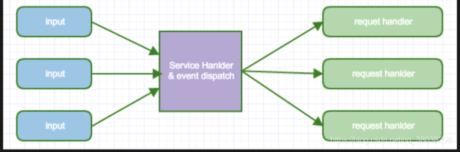

# io及其概念
## 流的概念和作用
流：代表任何有能力产出数据的数据源对象或者是有能力接受数据的接收端对象。<Thinking in Java>
流的本质：数据传输，根据数据传输特性将流抽象为各种类，方便更直观的进行数据操作。
流的作用：为数据源和目的地建立一个输送通道。
Java 中将输入输出抽象称为流，就好像水管，将两个容器连接起来。流是一组有顺序的，有起点和终点的字节集合，是对数据传输的总称或抽象。即数据在两设备间的传输称为流。

每个流只能是输入流或输出流的一种，不能同时具备两个功能，输入流只能进行读操作，对输出流只能进行写操作。在一个数据传输通道中，如果既要写入数据，又要读取数据，则要分别提供两个流。

## io模型
五种 IO 模型包括：阻塞 IO、非阻塞 IO、信号驱动 IO、IO 多路复用、异步 IO。其中，前四个被称为同步 IO。在网络环境下，可以将 IO 分为两步： 1.等待数据到来； 2.数据搬迁。 在互联网应用中，IO 线程大多被阻塞在等待数据的过程中，所以，如果要想提高 IO 效率，需要降低等待的时间

### 2.1 阻塞 IO（Blocking I/O）
在内核将数据准备好之前，系统调用会一直等待所有的套接字（Socket），默认的是阻塞方式
Java 中的 socket.read()会调用 native read()，而 Java 中的 native 方法会调用操作系统底层的 dll，而 dll 是 C/C++编写的，图中的 recvfrom 其实是 C 语言 socket 编程中的一个方法。所以其实我们在 Java 中调用 socket.read()最后也会调用到图中的 recvfrom 方法。

应用程序(也就是我们的代码)想要读取数据就会调用 recvfrom，而 recvfrom 会通知 OS 来执行，OS 就会判断数据报是否准备好(比如判断是否收到了一个完整的 UDP 报文，如果收到 UDP 报文不完整，那么就继续等待)。当数据包准备好了之后，OS 就会将数据从内核空间拷贝到用户空间(因为我们的用户程序只能获取用户空间的内存，无法直接获取内核空间的内存)。拷贝完成之后 socket.read()就会解除阻塞，并得到 read 的结果。

BIO 中的阻塞，就是阻塞在 2 个地方：

OS 等待数据报(通过网络发送过来)准备好。
将数据从内核空间拷贝到用户空间。
在这 2 个时候，我们的 BIO 程序就是占着茅坑不拉屎，啥事情都不干。

### 2.2 非阻塞 IO（Noblocking I/O）

每次应用进程询问内核是否有数据报准备好，当有数据报准备好时，就进行拷贝数据报的操作，从内核拷贝到用户空间，和拷贝完成返回的这段时间，应用进程是阻塞的。但在没有数据报准备好时，并不会阻塞程序，内核直接返回未准备就绪的信号，等待应用进程的下一个轮询。但是，轮询对于 CPU 来说是较大的浪费，一般只有在特定的场景下才使用。

Java 的 NIO 就是采用这种方式，当我们 new 了一个 socket 后我们可以设置它是非阻塞的。比如：

```java
// 初始化一个 serverSocketChannel
serverSocketChannel = ServerSocketChannel.open();
serverSocketChannel.bind(new InetSocketAddress(8000));
// 设置serverSocketChannel为非阻塞模式
// 即 accept()会立即得到返回
serverSocketChannel.configureBlocking(false);
```

上面的代码是设置 ServerSocketChannel 为非阻塞，SocketChannel 也可以设置。

从图中可以看到，当设置为非阻塞后，我们的 socket.read()方法就会立即得到一个返回结果(成功 or 失败)，我们可以根据返回结果执行不同的逻辑，比如在失败时，我们可以做一些其他的事情。但事实上这种方式也是低效的，因为我们不得不使用轮询方法去一直问 OS：“我的数据好了没啊”。

NIO 不会在 recvfrom（询问数据是否准备好）时阻塞，但还是会在将数据从内核空间拷贝到用户空间时阻塞。一定要注意这个地方，Non-Blocking 还是会阻塞的。

### 2.3 IO 多路复用（I/O Multiplexing）

传统情况下 client 与 server 通信需要 3 个 socket(客户端的 socket，服务端的 server socket，服务端中用来和客户端通信的 socket)，而在 IO 多路复用中，客户端与服务端通信需要的不是 socket，而是 3 个 channel，通过 channel 可以完成与 socket 同样的操作，channel 的底层还是使用的 socket 进行通信，但是多个 channel 只对应一个 socket(可能不只是一个，但是 socket 的数量一定少于 channel 数量)，这样仅仅通过少量的 socket 就可以完成更多的连接，提高了 client 容量。

其中，不同的操作系统，对此有不同的实现：

+ Windows：selector
+ Linux：epoll
+ Mac：kqueue
其中 epoll，kqueue 比 selector 更为高效，这是因为他们监听方式的不同。selector 的监听是通过轮询 FD_SETSIZE 来问每一个 socket：“你改变了吗？”，假若监听到事件，那么 selector 就会调用相应的事件处理器进行处理。但是 epoll 与 kqueue 不同，他们把 socket 与事件绑定在一起，当监听到 socket 变化时，立即可以调用相应的处理。 selector，epoll，kqueue 都属于 Reactor IO 设计。

### 2.4 信号驱动（Signal driven IO）
信号驱动 IO 模型，应用进程告诉内核：当数据报准备好的时候，给我发送一个信号，对 SIGIO 信号进行捕捉，并且调用我的信号处理函数来获取数据报。

### 异步 IO（Asynchronous I/O）
Asynchronous IO 调用中是真正的无阻塞，其他 IO model 中多少会有点阻塞。程序发起 read 操作之后，立刻就可以开始去做其它的事。而在内核角度，当它受到一个 asynchronous read 之后，首先它会立刻返回，所以不会对用户进程产生任何 block。然后，kernel 会等待数据准备完成，然后将数据拷贝到用户内存，当这一切都完成之后，kernel 会给用户进程发送一个 signal，告诉它 read 操作完成了。

可以看出，阻塞程度：阻塞 IO>非阻塞 IO>多路转接 IO>信号驱动 IO>异步 IO，效率是由低到高的

## io模式

###  Reactor
Reactor(反应器)的设计是一种事件驱动思想，比如 Java NIO 中，socket 过来时有四种事件： connectable acceptable readable writable 我们为每一种事件都编写一个处理器，然后设置每个 socket 要监听哪种情况，随后就可以调用对应的处理器。

图中的 input 就可以当作 socket，中间的 Service Hanlder&event dispatch 的作用就是监听每一个 socket(需要实现把 socket 注册进来，并指定要监听哪种情况)，然后给 socket 派发不同的事件。

单Reactor单线程
这是最简单的单Reactor单线程模型。Reactor线程是个多面手，负责多路分离套接字，Accept新连接，并分派请求到处理器链中。该模型适用于处理器链中业务处理组件能快速完成的场景。不过这种单线程模型不能充分利用多核资源，所以实际使用的不多。

单Reactor多线程
该模型在事件处理器（Handler）链部分采用了多线程（线程池），也是后端程序常用的模型。

主从Reactor多线程
比起第二种模型，它是将Reactor分成两部分，mainReactor负责监听并accept新连接，然后将建立的socket通过多路复用器（Acceptor）分派给subReactor。subReactor负责多路分离已连接的socket，读写网络数据；业务处理功能，其交给worker线程池完成。通常，subReactor个数上可与CPU个数等同。

